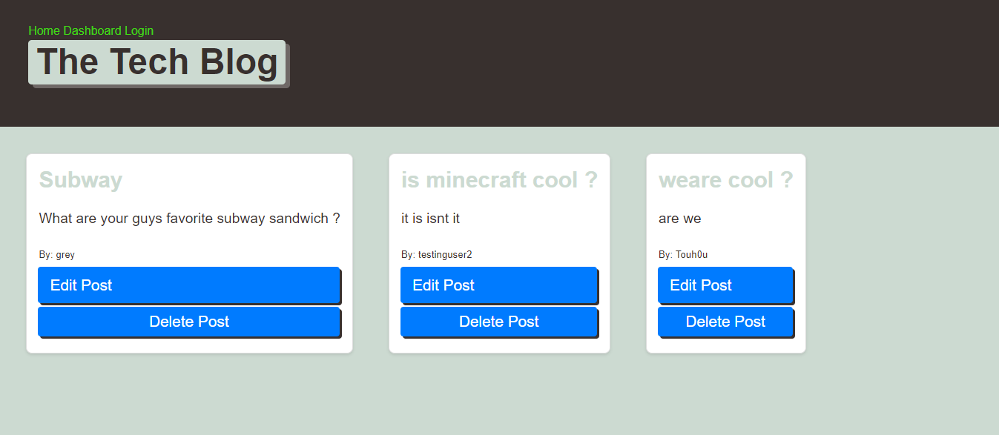
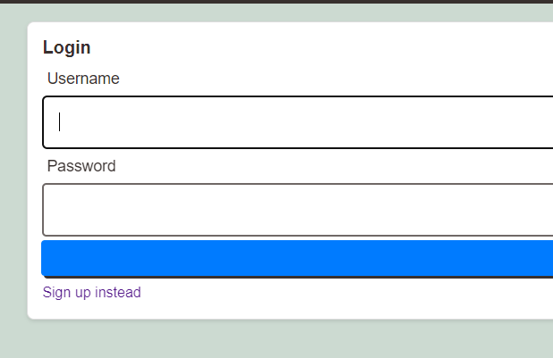
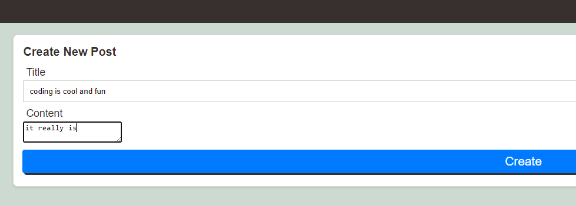
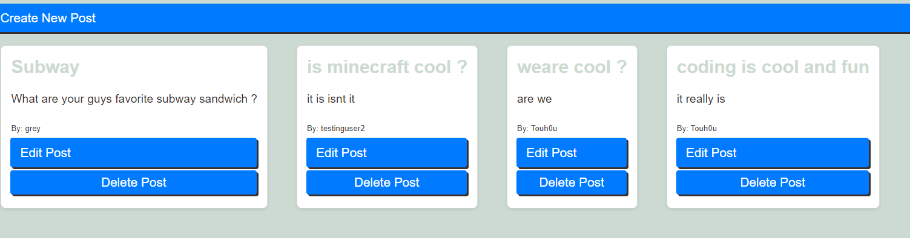

# tech-blog

## Description
- be able to communicate with people by voicing your opinions on a blog and starting converstaions with them on topics you love.

## Installation
- Git clone the repo at https://www.github.com/Edesp1/tech-blog or view the deployed app here: 
- Please do npm i to install all dependencies
- then follow up with npm start to run the app

## Usage
- once loaded onto the site you will be met with some posts and links
 
- you can then click on login to start making posts

  
- once logged in you can click on create post and itll prompt you to creating a post
 

 -once you click on create post itll show up on the dashboard
  

## Collaborations
- Collaborations are closed until further notice thank you

## License
- This project is under the MIT license

## Badges
